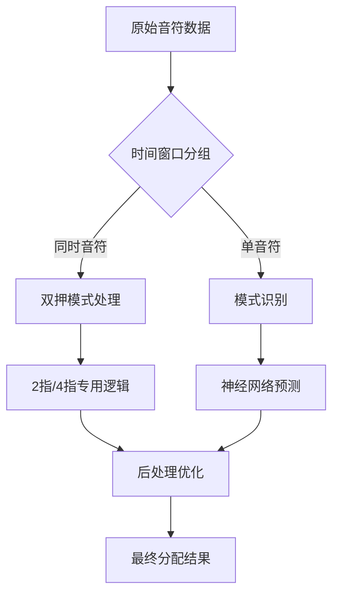

# PhiTK Advanced AI, 下一代手部分配Agent

# Hand.rs 模块技术文档

## 1. 模块架构详解

### 1.1 整体架构图
```
┌─────────────────────────────────────────────────────────────────┐
│                        PhiTKAdvancedAI                        │
├───────────────┬───────────────┬───────────────┬───────────────┤
│  Neural Net   │ Feature       │ Experience    │ Hand State    │
│  (DNN/LSTM)   │ Extraction    │ Replay        │ Management    │
├───────────────┼───────────────┼───────────────┼───────────────┤
│ GPU Acceleration │ Multi-threading │ Pattern Recognition │
└─────────────────────────────────────────────────────────────────┘
```

### 1.2 核心组件交互流程
1. **输入处理**：接收原始音符数据 → 预处理为`ProcessedNote`
2. **特征提取**：提取时空特征 → 生成特征向量
3. **AI决策**：特征向量输入神经网络 → 生成手部分配建议
4. **后处理**：结合游戏模式规则 → 生成最终分配结果
5. **经验存储**：记录决策过程 → 更新经验回放缓冲区

## 2. 核心结构深度解析

### 2.1 PhiTKAdvancedAI 结构体字段详解

| 字段 | 类型 | 作用 | 线程安全 | 默认值 |
|------|------|------|----------|--------|
| `main_network` | DeepNeuralNetwork | 当前决策网络 | Arc<Mutex<>> | 随机初始化 |
| `target_network` | DeepNeuralNetwork | 目标网络（Q-learning） | Arc<Mutex<>> | 延迟初始化 |
| `thread_pool` | Option<Arc<ThreadPool>> | 线程池控制 | 一次性初始化 | 根据CPU核心数 |
| `rotation` | f32 | 谱面旋转角度（-180~180） | 不可变 | 0.0 |
| `game_mode` | GameMode | 游戏模式（2/4指） | 原子操作 | TwoFinger |
| `recent_assignments` | VecDeque<(Hand,f32,f32)> | 最近分配记录 | 互斥锁保护 | 空队列 |
| `hand_switch_count` | u32 | 手部切换计数器 | 原子操作 | 0 |

**关键设计说明**：
- 所有可变状态均通过`Mutex`保护，确保多线程安全
- `rotation`字段为只读设计，避免运行时谱面旋转导致的逻辑混乱
- `recent_assignments`使用环形缓冲区，保留最近100次分配记录用于模式分析

### 2.2 DeepNeuralNetwork 实现细节

#### 网络架构（当前配置）
```
Input (28) → GELU(128) → GELU(256) → GELU(256) → Output(4)
```

#### 层类型对比表

| 层类型 | 适用场景 | 计算复杂度 | GPU加速收益 |
|--------|----------|------------|-------------|
| Dense | 基础特征处理 | O(n²) | 中等 (2-3x) |
| LSTM | 时序模式识别 | O(n³) | 高 (5-8x) |
| Attention | 复杂模式关联 | O(n²) | 高 (4-6x) |
| Residual | 梯度稳定 | O(n) | 低 (1-2x) |

**GPU加速实现**：
- 使用WebGPU的Compute Shader实现矩阵乘法
- 自动检测软件渲染器（llvmpipe/swiftshader）并降级到CPU
- 支持动态批处理（batch_size=24）

```rust
// GPU初始化关键代码
if adapter_info.vendor == 0x10005 { // Mesa软件渲染器
    return false; // 强制CPU回退
}
```

## 3. 核心算法深度剖析

### 3.1 手部分配决策流程



#### 同时音符分组算法
```rust
fn detect_simultaneous_groups(&self, notes: &[ProcessedNote]) -> Vec<Vec<usize>> {
    let mut groups = Vec::new();
    let mut current_group = Vec::new();
    
    for i in 0..notes.len() {
        if i == 0 || (notes[i].time - notes[i-1].time) < 0.05 {
            current_group.push(i);
        } else {
            if !current_group.is_empty() {
                groups.push(current_group);
                current_group = Vec::new();
            }
            current_group.push(i);
        }
    }
    if !current_group.is_empty() { groups.push(current_group); }
    groups
}
```
**参数说明**：
- 时间窗口阈值：50ms（可配置）
- 最大组大小：8个音符（防止单组过大）

### 3.2 神经网络训练机制

#### 经验回放工作流程
```
1. 收集经验：存储(state, action, reward, next_state)
2. 采样批次：随机抽取64个样本
3. 计算目标值：Q(s,a) = r + γ·max_a' Q'(s',a')
4. 网络更新：使用MSE损失函数更新main_network
5. 目标网络同步：每1000步更新target_network
```

#### 关键训练参数
| 参数 | 作用 | 推荐值 | 调整建议 |
|------|------|--------|----------|
| `discount_factor` | 未来奖励衰减 | 0.95 | 高难度谱面适当降低 |
| `target_update_freq` | 目标网络更新频率 | 1000 | 太低导致不稳定 |
| `batch_size` | 训练批次大小 | 24 | GPU显存限制 |
| `max_grad_norm` | 梯度裁剪阈值 | 5.0 | 防止梯度爆炸 |

### 3.3 特征工程实现

#### 空间特征提取
```rust
fn extract_spatial_features(&self, notes: &[ProcessedNote]) -> Vec<f32> {
    let center = self.calculate_center(notes);
    let mut features = vec![
        self.calculate_spread_radius(notes, &center),
        self.calculate_direction_entropy(notes),
        self.calculate_cluster_count(notes),
        self.calculate_symmetry_score(notes)
    ];
    
    // 添加位置直方图特征（10个区间）
    let mut hist = vec![0.0; 10];
    for note in notes {
        let bin = ((note.position.x + 1.0) * 5.0) as usize;
        hist[bin.min(9)] += 1.0;
    }
    features.extend(hist);
    
    features
}
```

#### 时间特征提取关键指标
| 特征 | 计算方式 | 作用 |
|------|----------|------|
| 节奏密度 | 音符数/时间窗口 | 判断段落难度 |
| 速度变化率 | ΔBPM/Δt | 检测变速段落 |
| 时序熵 | -Σ p(t)log p(t) | 判断节奏规律性 |
| 连打长度 | 最长连续音符数 | 优化连打分配 |

## 4. 高级配置指南

### 4.1 游戏模式深度配置

#### 2指模式配置模板
```rust
let mut ai = PhiTKAdvancedAI::new(rotation);
ai.game_mode = GameMode::TwoFinger;
ai.config = HandConfig {
    exploration_rate: 0.03,
    hand_switch_penalty: 0.35,
    position_tolerance: 0.18,
    balance_threshold: 0.55,
    consecutive_threshold: 2,
    center_region_bonus: 0.25,
    // ... 其他参数
};
```

**参数调优建议**：
- **高密度双押**：降低`position_tolerance`至0.12，提高`center_region_bonus`至0.3
- **慢速谱面**：提高`consecutive_threshold`至3，降低`hand_switch_penalty`至0.25

#### 4指模式特殊配置
```rust
ai.config.four_finger = FourFingerConfig {
    finger_spacing: 0.35, // 手指间距阈值
    cross_hand_threshold: 0.6, // 交叉手判定阈值
    finger_priority: vec![0.4, 0.3, 0.2, 0.1], // 手指优先级
    fatigue_decay: 0.02, // 疲劳衰减率
};
```

### 4.2 GPU性能调优

#### 显存优化技巧
1. **降低batch_size**：从24→16可减少40%显存占用
2. **关闭非必要层**：设置`activation_pipelinotes`为None
3. **使用FP16**：在支持的硬件上启用半精度计算

#### 常见GPU问题解决方案
| 问题现象 | 原因 | 解决方案 |
|----------|------|----------|
| 初始化失败 | 软件渲染器 | 设置`WGPU_BACKEND=primary` |
| 性能低下 | 驱动过旧 | 更新至最新Vulkan驱动 |
| 内存泄漏 | 未释放资源 | 调用`cleanup_gpu_resources()` |

## 5. 高级调试技术

### 5.1 实时决策监控

#### 启用详细日志
```rust
// 在main.rs中添加
#[cfg(feature = "log")]
extern crate::log;

// 在AI初始化后
ai.enable_debug_logging(true);
```

#### 关键日志格式
```
[AI-DEBUG] T=2.34s | Line=0 | Mode=2Finger
  Note: (x=0.25, t=0.05s) | Features: [0.7, 0.3, ...]
  Network: L=0.82(↑0.15) R=0.65(↓0.08) | Decision=Left
  Reason: Alternating pattern detected (prev=Right)
```

### 5.2 性能分析工具

#### CPU热点分析
```bash
# 生成火焰图
perf record -F 99 -g -- cargo run
perf script | inferno-flamegraph > flame.svg
```

#### GPU性能指标
| 指标 | 正常范围 | 问题阈值 |
|------|----------|----------|
| Compute Time | <5ms/frame | >10ms/frame |
| Memory Usage | <70% VRAM | >90% VRAM |
| Pipeline Switch | <100/frame | >500/frame |

## 6. 扩展开发指南

### 6.1 自定义模式识别

#### 添加新识别模式
```rust
impl AdvancedFeatureExtractor {
    fn detect_arpeggio(&self, notes: &[ProcessedNote]) -> bool {
        // 检测琶音模式（等时间间隔的渐进式音符）
        if notes.len() < 4 { return false; }
        
        let time_diffs: Vec<_> = notes.windows(2)
            .map(|w| w[1].time - w[0].time)
            .collect();
        
        // 检查时间间隔是否近似相等
        let avg = time_diffs.iter().sum::<f32>() / time_diffs.len() as f32;
        time_diffs.iter().all(|&d| (d - avg).abs() < 0.01)
    }
}
```

#### 注册新模式
```rust
// 在模式库初始化时
self.pattern_library.insert("arpeggio".to_string(), PatternSignature {
    name: "arpeggio".to_string(),
    features: vec![0.8, 0.2, 0.0, 0.0],
    difficulty_multiplier: 1.2,
    optimal_strategy: HandStrategy::Alternating,
    success_rate: 0.0,
    adaptation_count: 0,
});
```

### 6.2 神经网络架构定制

#### 添加自定义层
```rust
impl DeepNeuralNetwork {
    fn add_custom_layer(&mut self, input_size: usize, output_size: usize) {
        let layer = NetworkLayer {
            weights: vec![vec![0.0; input_size]; output_size],
            biases: vec![0.0; output_size],
            activation_func: ActivationFunction::GELU,
            layer_type: LayerType::Custom("Wavelet".to_string()),
            // ... 其他字段
        };
        self.layers.push(layer);
    }
}
```

#### 自定义激活函数
```wgsl
// 在custom_activation.wgsl中
fn wavelet_activation(x: f32) -> f32 {
    return x * cos(3.1415926 * x * 2.0);
}
```
## 7. 故障排除手册

### 7.1 典型问题诊断树

```
手部分配异常？
├─▶ 检查rotation参数是否正确
├─▶ 验证BPM列表是否完整
├─▶ 查看特征提取日志
│  ├─▶ 特征异常 → 检查预处理逻辑
│  └─▶ 特征正常 → 检查网络输出
└─▶ 网络输出异常
   ├─▶ 权重是否NaN → 检查梯度裁剪
   └─▶ 输出无变化 → 检查学习率
```

### 7.2 紧急恢复方案

#### 模型损坏恢复
```bash
# 重置为默认模型
cp prpr/assets/default_ai_model.bin phitk_ai_model.bin

# 或从备份恢复
tar -xzf ai_model_backup_20250929.tgz
```

#### 实时参数调整
```rust
// 在运行时调整参数
ai.set_parameter("exploration_rate", 0.01);
ai.set_parameter("confidence_threshold", 0.85);
```

## 8. 附录

### 8.1 音符特征向量格式
```
[0]  当前时间位置（归一化）
[1]  相对BPM变化率
[2]  前一个音符时间差
[3]  后一个音符时间差
[4]  X坐标位置
[5]  Y坐标位置
[6]  前一个音符X差值
[7]  前一个音符Y差值
[8]  手部切换历史（最近5次）
[9]  当前手部使用率
[10] 模式识别置信度
...  其他动态特征
```

### 8.2 网络输出解释
| 输出索引 | 含义 | 范围 | 用途 |
|----------|------|------|------|
| 0 | 左手置信度 | [0,1] | 主要决策依据 |
| 1 | 右手置信度 | [0,1] | 主要决策依据 |
| 2 | 稳定性指标 | [0.3,0.96] | 用于难度调节 |
| 3 | 即时奖励 | [-1,1] | 用于训练反馈 |

---
*本文档最后更新时间：2025-10-01*
*技术审核：Link*